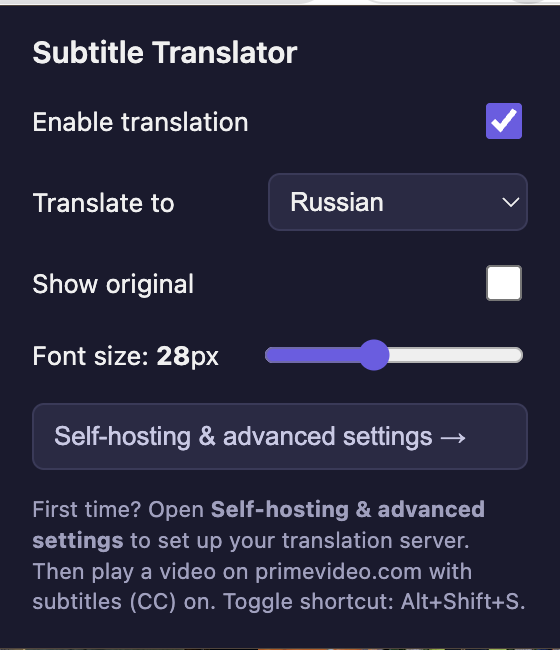
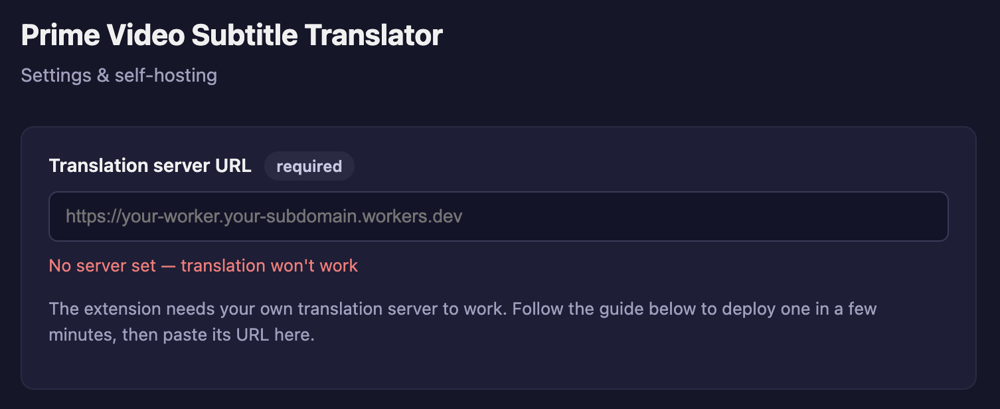

# Prime Video Subtitle Translator

A Chrome extension (Manifest V3) that translates Prime Video's built-in
subtitles in real time and shows the translation over the player. No ads, no
trackers.

It translates the subtitle track you **already turn on** in the player (CC) — it
does not transcribe audio.

## Screenshots

## How it works

Translation runs through a small proxy (a Cloudflare Worker) that holds a Google
Cloud Translation API key, so the key never ships inside the extension. There is
**no built-in server** — you deploy your own worker and paste its URL in the
extension options. This keeps translation costs on your own account and under
your control.

## Install (from source)

1. Clone or download this repository.
2. Open `chrome://extensions/` and enable **Developer mode** (top right).
3. Click **Load unpacked** and select the repository root folder.
4. The extension icon appears in the Chrome toolbar.

## Set up your translation server (required)

Open the extension options (popup → **Self-hosting & advanced settings**) and
follow the built-in guide, or see [`backend/README.md`](backend/README.md). In
short:

1. Get a Google Cloud Translation API key (enable the API, create a key).
2. Deploy the Cloudflare Worker from [`backend/`](backend) with `wrangler`.
3. Paste the worker URL into the options.

## Usage

1. Open a title on https://www.primevideo.com/.
2. Turn on subtitles (**CC**) in the player — any available track.
3. Click the extension icon, pick your target language.
4. The translation appears over the original subtitles, including in fullscreen.

> Just installed the extension? **Reload the video tab** — the content script
> only injects on page load.

Toggle translation on/off any time with **Alt+Shift+S**.

## Settings

| Setting | What it does |
|---------|--------------|
| Enable translation | Global on/off (also Alt+Shift+S) |
| Translate to | Target language |
| Show original | Show the source text under the translation |
| Font size | Translation text size |
| Translation server URL | In the options page: your worker URL (required) |

## Documentation

- [`backend/README.md`](backend/README.md) — deploy your own translation server.
- [`docs/DEVELOPMENT.md`](docs/DEVELOPMENT.md) — architecture, file map, local
  development and testing.
- [`docs/PUBLISHING.md`](docs/PUBLISHING.md) — Chrome Web Store submission notes.
- [`PRIVACY.md`](PRIVACY.md) — privacy policy.
- [`CHANGELOG.md`](CHANGELOG.md) — change history.

## Limitations

- Works only with text (DOM) subtitles; image-based subtitles burned into the
  video cannot be translated.
- Automating Prime Video and routing subtitles through a third-party translator
  may conflict with Amazon's Terms of Service — keep that in mind.

## License

[MIT](LICENSE)
